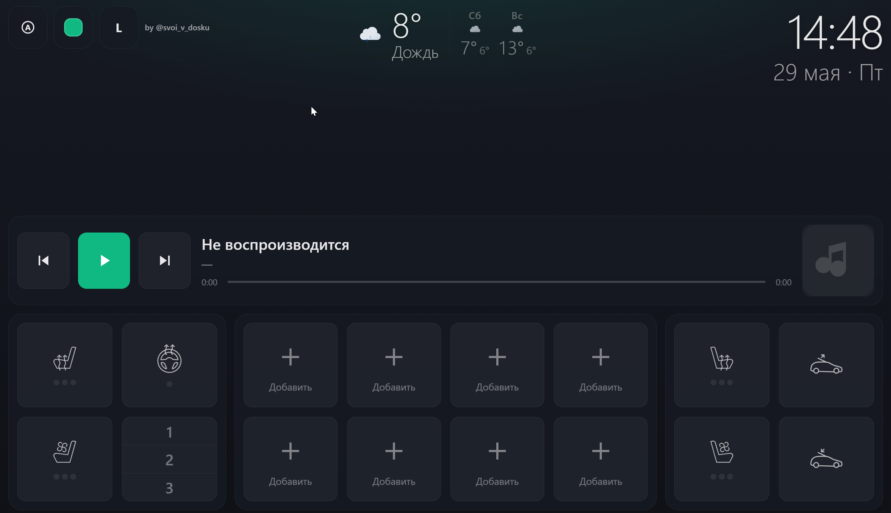

# Lite by @svoi_v_dosku

Лаунчер «чёрного экрана» для **JCarTools WebView**: плеер, климат, громкость, температура и быстрый запуск приложений. Работает в Android WebView через `window.androidApi`; в браузере без API доступны локальные настройки темы и акцента.

---

## Общие сведения об API

| Параметр | Значение |
| --- | --- |
| **TOKEN** | `"SECURE_TOKEN_2025"` — первый аргумент почти всех вызовов `androidApi` |
| **Инициализация** | `onJsReady(TOKEN)` **до** вызовов `runEnum` / `runApp` / `getUserApps` (`ensureJsReady` в `01-utils.js`, `09-init.js`) |
| **runEnum** | `androidApi.runEnum(TOKEN, cmd)` — команды медиа, климата, сидений и т.д. |
| **runApp** | `androidApi.runApp(TOKEN, packageName)` — запуск приложения |
| **getUserApps** | `androidApi.getUserApps(TOKEN)` — список приложений для шторки |

---

## Верхняя панель

| Кнопка / UI | Расположение | Действие | API / команда |
| --- | --- | --- | --- |
| **Тема** `#btn-theme` | Верх слева | Циклическое переключение режима: **auto → dark → light → auto**. Сохраняет в `localStorage` (`lite_theme_mode`). В режиме **auto** читает тему через `androidApi` (`getTheme`, `getUiMode`, …) после `onJsReady`, с fallback на `prefers-color-scheme`; опрос каждые 2 с и повторные чтения после `onJsReady` | Локально: `document.documentElement.dataset.theme`. События Android: `theme` (`mode`), `uimode`, `nightmode`, `configurationchanged` и др. → `ThemeManager.handleThemeEvent`; также `window.onSystemThemeChange` / `onThemeChange` / `onUiModeChange` |
| **Акцент** `#btn-accent` | Верх слева, рядом с темой | Открывает/закрывает палитру акцента `#accent-popup` | — |
| **Точка цвета** `.accent-dot` (×8) | Попап `#accent-btns` | Выбирает цвет акцента, обновляет CSS-переменные `--accent*`, сохраняет в `localStorage` (`lite_accent`), закрывает попап | — |
| **Масштаб** `#btn-scale` | Верх слева, рядом с акцентом | Циклическое переключение **L → M → S → L**. Масштабирует кнопки, часы, шрифты и отступы через `--ui-scale`; сетка и колонки не меняются | Локально: `document.documentElement.dataset.uiScale`, `localStorage` (`lite_ui_scale`) |
| **Закрытие попапа акцента** | Клик вне `#accent-popup` и `#btn-accent` | Скрывает палитру | — |

---

## Плеер

| Кнопка / UI | Расположение | Действие | API / команда |
| --- | --- | --- | --- |
| **Mute** `#btn-mute` | Плеер, слева | Mute/unmute через `VolumeManager`: `setvol` + echo-suppression (4 с), fallback `runEnum` | `getvol` / `setvol`, событие `volumeChanged` |
| **Play / Pause** `#btn-play` | Плеер, центр | Переключает иконку play/pause и отправляет команду воспроизведения | `runEnum(TOKEN, "MEDIA_PLAY")` или `"MEDIA_PAUSE"`. Состояние также обновляется событием `musicInfo` |
| **Next** `#btn-next` | Плеер, справа | Следующий трек | `runEnum(TOKEN, "MEDIA_NEXT")` |

---

## Климат — водитель (`#driver-grid`)

| Кнопка / UI | Расположение | Действие | API / команда |
| --- | --- | --- | --- |
| **Подогрев сиденья** `#cl-seat-l` | Карточка водителя | Цикл уровней **0 → 1 → 2 → 3 → 0**. При включении сбрасывает вентиляцию `#cl-vent-l`. **Долгое нажатие 600 ms** — выключить (уровень 0) | `heat_seat_l_1` … `heat_seat_l_3`, выкл: `heat_seat_l_0` |
| **Обогрев руля** `#cl-wheel` | Карточка водителя | Цикл **0 ↔ 1** (вкл/выкл) | Вкл: `heat_wheel_on`, выкл: `heat_wheel_off` |
| **Вентиляция сиденья** `#cl-vent-l` | Карточка водителя | Цикл **0 → 1 → 2 → 3 → 0**. При включении сбрасывает подогрев `#cl-seat-l`. Долгое нажатие 600 ms — выкл | `vent_seat_l_1` … `vent_seat_l_3`, выкл: `vent_seat_l_0` |
| **Память сиденья** `#cl-memory` (сегменты 1, 2, 3) | Карточка водителя | Выбор слота памяти водительского сиденья | `voditel_seat_1`, `voditel_seat_2`, `voditel_seat_3` |

---

## Климат — пассажир (`#passenger-grid`, `#passenger-vol`)

| Кнопка / UI | Расположение | Действие | API / команда |
| --- | --- | --- | --- |
| **Подогрев сиденья** `#cl-seat-r` | Карточка пассажира | Цикл **0 → 1 → 2 → 3 → 0**. Взаимоисключение с `#cl-vent-r`. Долгое нажатие 600 ms — выкл | `heat_seat_r_1` … `heat_seat_r_3`, выкл: `heat_seat_r_0` |
| **Вентиляция сиденья** `#cl-vent-r` | Карточка пассажира | Цикл **0 → 1 → 2 → 3 → 0**. Взаимоисключение с `#cl-seat-r`. Долгое нажатие 600 ms — выкл | `vent_seat_r_1` … `vent_seat_r_3`, выкл: `vent_seat_r_0` |
| **Открыть шторку** `#btn-shutter-open` | Справа от сетки пассажира | Открывает системную шторку | `runEnum(TOKEN, "OPEN_SHTORKA")` |
| **Закрыть шторку** `#btn-shutter-close` | Справа от сетки пассажира | Закрывает системную шторку | `runEnum(TOKEN, "CLOSE_SHTORKA")` |

---

## Температура (`#temp-row`)

| Кнопка / UI | Расположение | Действие | API / команда |
| --- | --- | --- | --- |
| **Темп. водителя −** `#btn-driver-temp-down` | Нижний ряд, слева | −1° | `runEnum(TOKEN, "Driver_Temp_Down")` |
| **Темп. водителя +** `#btn-driver-temp-up` | Нижний ряд, слева | +1° | `runEnum(TOKEN, "Driver_Temp_Up")` |
| **SYNC** `#btn-temp-sync` | Нижний ряд, центр | Выравнивает температуру пассажира с водителем (пошагово) | `Passenger_Temp_Up` / `Passenger_Temp_Down` |
| **Темп. пассажира −** `#btn-passenger-temp-down` | Нижний ряд, справа | −1° | `runEnum(TOKEN, "Passenger_Temp_Down")` |
| **Темп. пассажира +** `#btn-passenger-temp-up` | Нижний ряд, справа | +1° | `runEnum(TOKEN, "Passenger_Temp_Up")` |
| **Дисплеи** `#temp-driver-value`, `#temp-passenger-value` | Между кнопками ± | Текущие значения, опрос каждые 3 с | `getCarData(TOKEN, "cabinTemp")` / `"heat"` / `"driverTemp"` / `"passengerTemp"` |

---

## Мои приложения (`#my-grid`)

8 слотов (`.my-slot`, `data-slot="1"` … `"8"`). Данные слота: `localStorage` ключ `lite_my_N` → `{ pkg, name, icon }`.

| Кнопка / UI | Расположение | Действие | API / команда |
| --- | --- | --- | --- |
| **Слот с приложением** `.my-slot` (заполненный) | Центральная карточка «Мои приложения» | Запуск сохранённого приложения | `runApp(TOKEN, pkg)` |
| **Слот «Добавить»** `.my-slot` (пустой) | Та же карточка | Открывает шторку выбора приложения | `getUserApps(TOKEN)` при открытии шторки |
| **Долгое нажатие на слот** (700 ms) | Любой заполненный слот | Удаляет приложение из слота (`localStorage.removeItem`) | — |

---

## Шторка приложений (`#apps-drawer`)

| Кнопка / UI | Расположение | Действие | API / команда |
| --- | --- | --- | --- |
| **Закрыть** `#drawer-close` | Заголовок шторки | Закрывает шторку, сбрасывает `pickerSlot` | — |
| **Элемент списка** `.app-item` | `#apps-grid` | Если открыто из пустого слота — сохраняет приложение в `lite_my_{slot}`, обновляет сетку, закрывает шторку | `getUserApps(TOKEN)` (загрузка списка); сохранение локально; при запуске из слота — `runApp(TOKEN, package)` |

---

## Сводка runEnum по разделам

| Раздел | Команды |
| --- | --- |
| Плеер | `MEDIA_PLAY`, `MEDIA_PAUSE`, `MEDIA_NEXT`, `Volume_Up`, `Volume_Down` |
| Громкость | `getvol`, `setvol` (чтение; управление — через `Volume_Up`/`Volume_Down`) |
| Водитель — сиденье | `heat_seat_l_0` … `heat_seat_l_3` |
| Водитель — руль | `heat_wheel_on`, `heat_wheel_off` |
| Водитель — вентиляция | `vent_seat_l_0` … `vent_seat_l_3` |
| Водитель — память | `voditel_seat_1`, `voditel_seat_2`, `voditel_seat_3` |
| Пассажир — сиденье | `heat_seat_r_0` … `heat_seat_r_3` |
| Пассажир — вентиляция | `vent_seat_r_0` … `vent_seat_r_3` |
| Температура | `Driver_Temp_Up`, `Driver_Temp_Down`, `Passenger_Temp_Up`, `Passenger_Temp_Down` |

---

## localStorage (настройки UI)

| Ключ | Назначение |
| --- | --- |
| `lite_theme_mode` | `dark` / `light` / `auto` |
| `lite_accent` | HEX цвет акцента |
| `lite_ui_scale` | `l` / `m` / `s` — масштаб интерфейса |
| `lite_my_1` … `lite_my_8` | Сохранённые приложения в слотах |
| `lite_temp_mock` | `"1"` — mock температур в браузере без API |
